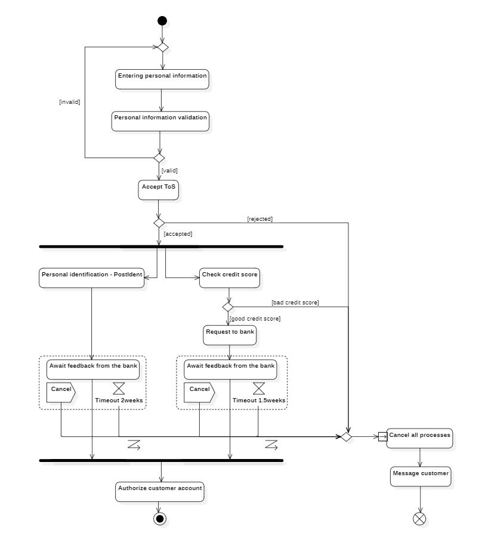
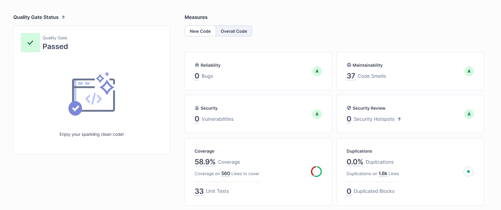
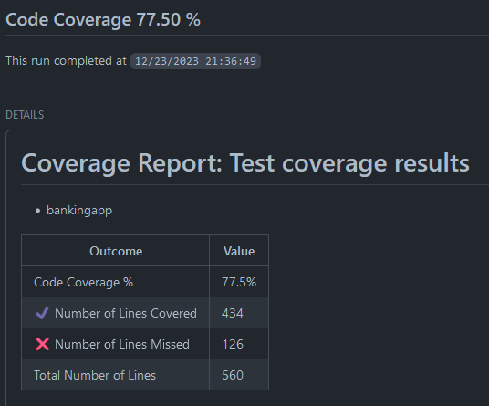
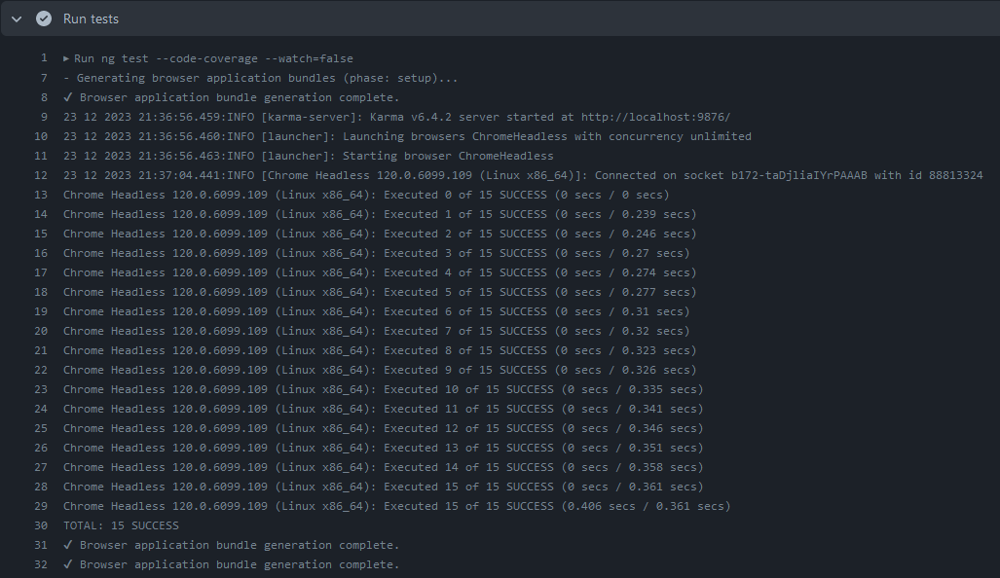

# Banking App
**Online Banking app with different account types**

## Table of Contents
- [Banking App](#banking-app)
  - [Table of Contents](#table-of-contents)
  - [Intro - Task A)](#intro---task-a)
    - [Requirements](#requirements)
    - [Features](#features)
    - [Preview](#preview)
  - [Documentation - Task B)](#documentation---task-b)
    - [1. Git](#1-git)
    - [2. UML](#2-uml)
    - [3. DDD](#3-ddd)
    - [4. Metrics](#4-metrics)
    - [5. Clean Code Development](#5-clean-code-development)
    - [6. Build Management](#6-build-management)
    - [7. CI/CD](#7-cicd)
    - [8. Unit Tests](#8-unit-tests)
    - [9. IDE](#9-ide)
    - [10. DSLs](#10-dsls)
    - [11. Functional Programming](#11-functional-programming)
  - [Task Completion](#task-completion)

## Intro - Task A)

### Requirements
  - Backend
    - Java 21
    - Maven     
  - Frontend
    - Node.js

### Features

- **User Authentication/Authorization**
  - Email registration
  - JWT tokens for authentication
  - Different user groups with different privileges
- **Account**
  - CRUD operations
- **Checking/Savings Accounts**
  - CRUD operations
  - Transfers
  - Annual interest calculation
  - Interest rate management
  - List and filter account transactions
  

This repository is a monorepository containing frontend and backend of the banking app. The [backend](bankingapp) is implemented with Spring Boot 3 and the [frontend](bankingapp-ui) with Angular 17.

### Preview
TODO add Frontend pictures

## Documentation - Task B)

### 1. Git
In this project, I used various Git features. I choose to use a monorepository for both applications. The project has a production branch ([main](https://github.com/EricCpy/BankingApp/blob/main)) and feature branches ([example](https://github.com/EricCpy/BankingApp/tree/feature/exampleForDocs)), which can only be merged into the main branch through a pull request with atleast one review. Therefore, it is not possible to push directly into the main branch (branch protection).

<div style="text-align:center">
  
</div>

I utilized different (uncommon) git features such as squashing commits, particularly when testing pipeline features with multiple small test commits. Additionally, I rebased most branches after changes on the main branch instead of merging to get a cleaner commit history.

### 2. UML
I used StarUML to make UML diagrams and experimented with PlantUML. However, arranging graphical components in my desired order was a bit tricky with PlantUML, which is why I stuck to StarUML. Overall, I created diagrams for deployment, components, use cases, and activities.

First, I made a use case diagram showing what functions the system should have and which actors can use them.

<br>
*Use Case Diagram*

The deployment diagram shows different hardware components, like clients connecting to the banking servers. It also has distributed database parts to prevent losing data. Besides the main server, there are components in each bank branch, like ATMs communicating to the main systems.

<br>
*Deployment Diagram*

The component diagram illustrates the main components needed for the system and their relationships.

<br>
*Component Diagram*

The activity diagram explains how a customer registers with the banking app, including extra steps for user identification like POSTIDENT.

<br>
*Activity Diagram*


### 3. DDD
I used Miro for event storming. At first, I brainstormed domain events and potential conflicts that could arise in the app.

<div style="text-align:center">
  
</div>

Then, I categorized these terms into different processes and further grouped them within the processes into smaller subsets.

<div style="text-align:center">
  
</div>

I assigned individual names to these groups and organized them in a Core Domain Chart. As shown in the image, my core domains primarily revolve around financial aspects such as trading and transferring money. These are intended to be supported by analysis sub-domains, which enhance the customer experience but are not essential. Tasks like withdrawing money from ATMs can be outsourced to third parties (generic domain).

<br>
*Core Domain Chart*

In the final step, I added relationships. The analysis domains are downstream of the core domains, which provides information for them, for example in trading. The money transfer and financial services have a shared core, they both require access to money transfer data and analytical data for proper functionality. This shared core enables both teams to easily communicate and access shared data. Example use case: Customers might receive recommendations for optimizing their spending behavior.

<br>
*Core Domain Chart with relations*

### 4. Metrics
The images shown here are from an early development stage of the backend. For the metrics, I used Sonarqube, which I set up using Docker. However, I chose not to put it into my pipelines because running an additional Sonarqube server for each pull request seemed impractical for this simple project.

To gather metrics, I used Sonarqube, which I set up using Docker. Nevertheless, I decided against integrating it into my pipelines because running an extra Sonarqube server for each pull request appeared impractical for this project.

Simple Docker Sonarqube setup, which i used:

```
docker run -d --name sonarqube -e SONAR_ES_BOOTSTRAP_CHECKS_DISABLE=true -p 9000:9000 sonarqube:latest
```
Login: admin
<br>
Password: admin

<br>
*Sonarqube*

I used JaCoCo to generate Java test coverage and integrated it into [my CI/CD pipeline](https://github.com/EricCpy/BankingApp/blob/main/.github/workflows/bankingapp.yml#L42).

<br>
*JaCoCo coverage report*

For frontend test coverage, I used Karma with Jasmine.

<br>
*Karma & Jasmine Coverage report*

In [my Frontend pipeline](https://github.com/EricCpy/BankingApp/blob/main/.github/workflows/bankingapp-ui.yml#L49) I also run a linter over my code to ensure stylistic correctness.

<br>
*Linter*

Furthermore, I integrated Grype security checks into both pipelines. Grype can scan dependency files such as pom.xml and packages from various tools and programming languages for vulnerabilities.

 <br>
*Grype Check*

### 5. Clean Code Development 
TODO

### 6. Build Management
For backend build management, I used Maven. In my [pom.xml](bankingapp/pom.xml) file, I defined a "dev" profile that starts a local H2 (in-memory) database. Additionally, the pom defines the project dependencies. These can be installed using `mvn install`. And listed with `mvn dependency:tree`.

```
[INFO] de.eric:bankingapp:jar:0.0.1-SNAPSHOT
[INFO] +- org.springframework.boot:spring-boot-starter:jar:3.2.0:compile
[INFO] |  +- org.springframework.boot:spring-boot:jar:3.2.0:compile
[INFO] |  |  \- org.springframework:spring-context:jar:6.1.1:compile
[INFO] |  +- org.springframework.boot:spring-boot-autoconfigure:jar:3.2.0:compile
[INFO] |  +- org.springframework.boot:spring-boot-starter-logging:jar:3.2.0:compile
[INFO] |  |  +- org.apache.logging.log4j:log4j-to-slf4j:jar:2.21.1:compile
[INFO] |  |  |  \- org.apache.logging.log4j:log4j-api:jar:2.21.1:compile
[INFO] |  |  \- org.slf4j:jul-to-slf4j:jar:2.0.9:compile
[INFO] |  +- jakarta.annotation:jakarta.annotation-api:jar:2.1.1:compile
[INFO] |  +- org.springframework:spring-core:jar:6.1.1:compile
[INFO] |  |  \- org.springframework:spring-jcl:jar:6.1.1:compile
[INFO] |  \- org.yaml:snakeyaml:jar:2.2:compile
[INFO] +- org.springframework.boot:spring-boot-starter-data-jpa:jar:3.2.0:compile
...
```
*Dependency Tree*

The `mvn package` command is used to compile the project and package it into a specified file format (in my case .jar). To generate documentation, I specified a [dependency](https://github.com/EricCpy/BankingApp/blob/main/bankingapp/pom.xml#L92) that can create Swagger docs from my endpoints. To determine the test coverage, I used a plugin called JaCoCo.


<br>
*Swagger Docs (http://localhost:8080/swagger-ui/index.html)*

For frontend development, I used npm, a package manager and the Angular CLI tool.

All of these tools are utilized in my CI/CD pipelines, which are explained in the following chapter.

### 7. CI/CD
In this step, it became noticeable that I am using a monorepo instead of individual repositories. This has made it more complicated to execute different (Github)actions for the frontend and the backend because many actions are performed on the root directory. This results in problems such as a missing pom.xml in the action. However, I have found some workarounds for this (pom.xml example: directory parameter). For future projects, I would definitely use separate repositories, as most (Github)actions are not designed for monorepos.
Both pipelines can be triggered either manually in GitHub (using workflow_dispatch) or automatically when there are changes in the respective directory.

[Backend pipeline](.github/workflows/bankingapp.yml) actions:
  - Set up Java 21
  - Build JAR package and run tests (maven package)
  - Update dependency graph in Github (displaying all project dependencies)
  - Create a [test coverage report](https://github.com/EricCpy/BankingApp/runs/19237311367) using JaCoCo and write the test coverage report in the job summary
  - Perform a Grype security check on dependencies, examining all used dependencies for vulnerabilities

<br>
*JaCoCo Report*

[Frontend pipeline](.github/workflows/bankingapp-ui.yml) actions:
  - Download Chrome driver to execute Angular Jasmine/Karma tests
  - Set up Node.js environment
  - Install dependencies
  - Run Karma/Jasmine tests with a code coverage report
  - Perform code linting and write code coverage from Karma/Jasmine and linting report in the [job summary](https://github.com/EricCpy/BankingApp/actions/runs/7066074767)
  - Run Cypress e2e tests
  - Perform a Grype security check on dependencies, although I have not set it to fail on vulnerabilities. This is because in JavaScript/TypeScript, seemingly everything has a vulnerability.

<br>
*Cypress Report*

### 8. Unit Tests
I have integrated unit tests in both the [frontend](bankingapp-ui/cypress) and [backend](bankingapp/src/test/java/de/eric/bankingapp/service). In both cases, all unit tests are executed in my pipelines. Additionally, two different types of unit tests have been used for the frontend: component tests with Karma/Jasmine, which are defined in the components (see [example](bankingapp-ui/src/app/header/header.component.spec.ts)) and end-to-end tests with [Cypress](bankingapp-ui/cypress).

### 9. IDE
I used IntelliJ and Vscode. I used IntelliJ for the Java application because IntelliJ has a very nice UI to execute various Maven and Java commands and automatically handles some tasks. I also used Vscode for the Angular frontend and to test the HTTP requests because there is a [Vscode extension](https://marketplace.visualstudio.com/items?itemName=humao.rest-client) for it and using such an extension in IntelliJ requires premium :( (without this extension I would need Postman).

**Favorite Shortcuts Overall**:
- Ctrl + Shift + F, to search for something in all project files

**Vscode**:
- Ctrl + Shift + P, to execute Vscode actions (for example to reload Vscode)
- Ctrl + ., for autocomplete and code action
- Ctrl + Shift + Ö, to open the terminal
- Shift + Alt + F, autoformat
  
**IntelliJ**:
- Ctrl + Alt + L, autoformat
- Ctrl + Shift + A, to open IntelliJ Actions
- Ctrl + Alt + O, to optimize imports / remove unused ones
- Alt + Enter, to perform code actions

I use these shortcuts the most while working. However, there are also other useful shortcuts that I sometimes use, but not nearly as often as these.

### 10. DSLs
I implemented the DSLs example for [transactions in the banking app](bankingapp/src/main/java/de/eric/bankingapp/banking/model/Transaction.java), where I used a builder pattern and a fluent interface, which allows method chaining.

I wrote this boilerplate code specifically for the example. Typically, for such scenarios, one would use libraries like Lombok, which provide a *@Builder* annotation to automatically generate a builder pattern ([Lombok example](bankingapp/src/main/java/de/eric/bankingapp/banking/model/BankingAccount.java)). However, if you need special chaining logic or validations, it can still be useful to create your own pattern instead of using Lombok.

### 11. Functional Programming
For this task, I programmed a [TicTacToe](functional-programming/tictactoe.clj) console game in Clojure.
Aspects of functional programming:
- only final data structures
  - In clojure all data structures are immutable
- (mostly) side-effect-free functions
  - Does not have side effects except print statements (if they count)
  - An example for a side-effect-free function is the 'execute-move' function, it takes the board player and field and returns a new board with the new executed move
    ```clojure
    (defn execute-move [player curr-player board field]
      (let [row (quot field (count board)) col (mod field (count board))]
        (println (format "%s placing %s in col %d and row %d" (if (= player curr-player) "You are""Enemy is") curr-player col row))
        (update-in board [row col] (constantly curr-player))
      )
    )
    ```
- the use of higher-order functions
  - I used higher order functions like [map](https://github.com/EricCpy/BankingApp/blob/main/functional-programming/tictactoe.clj#L85) and [every?](https://github.com/EricCpy/BankingApp/blob/main/functional-programming/tictactoe.clj#L81), these functions take other functions as parameters
  - My [ask-for-field](https://github.com/EricCpy/BankingApp/blob/main/functional-programming/tictactoe.clj#L52) also takes an function as parameters for the player input 
- functions as parameters and return values
  - The [create-tic-tac-toe](https://github.com/EricCpy/BankingApp/blob/main/functional-programming/tictactoe.clj#L105) returns a function with a user/programmer defined TicTacToe board size, which can be used to create multiple games of TicTacToe
- use closures / anonymous functions
  - The [create-tic-tac-toe](https://github.com/EricCpy/BankingApp/blob/main/functional-programming/tictactoe.clj#L105) is also an example for a closure, the return function remembers the create-tic-tac-toe input parameter
  - I use anonymous functions in many higher-order functions, like every?. For example, in the game over function to check if every field has been used
  ```clojure
  (defn game-over? [board]
    (every? (fn [row] (every? #{"X" "O"} row)) board)
  )
  ```

## Task Completion

- [x] DSL Create a small DSL Demo example snippet in your code even if it does not contribute to your project (hence it can also be in another language).
- [x] Integrate some nice unit tests in your Code to be integrated into the Build
- [ ] Clean Code Development: A) At least 5 points you can show me with an explanation of why this is clean code in your code and/or what has improved & B) >>10 points on your personal CCD cheat sheet. E.g. a PDF.
- [x] Functional Programming: prove that you have covered all functional aspects in your code as:
    - only final data structures
    - (mostly) side-effect-free functions 
    - the use of higher-order functions
    - functions as parameters and return values
    - use closures / anonymous functions
    - You can also do it outside of your project. Even in other languages such as F#, Clojure, Julia, etc. 
- [x] Use and understand Git!
- [x] UML at least 3 good different diagrams. "good" means you can pump it up artificially as written in DDD. You have 10 million $ from me! Please export the pics. I can not install all the tools to view them!
- [x] DDD If your domain is too small, invent other domains around and document these domains (as if you have 100 Mio € from Edlich-Investment!) Develop a clear strategic design with mappings/relationships with >4 Domains coming from an Event Storming. Drop your Domains into a Core Domain Chart and indicate the Relations between the Domains!
- [x] Metrics at least two. Sonarcube would be great. Other non-trivial metrics are also fine.
- [x] Build Management with any Build System as Ant, Maven, Gradle, etc. (only Travis is perhaps not enough) Do e.g. generate Docs, call tests, etc. (it could be also disconnected from the project just to learn a build tool!)
- [x] Continuous Delivery: show me your pipeline using e.g. Jenkins, Travis-CI, Circle-CI, GitHub Action, GitLab CI, etc. E.g. you can also use Jenkins Pipelining or BlueOcean, etc. But at least insert more than 2 script calls as done in the lecture! (e.g. also call Ant or Gradle or something else).
- [x] Use a good IDE and get fluent with it: e.g. IntelliJ. What are your favourite key shortcuts?!


